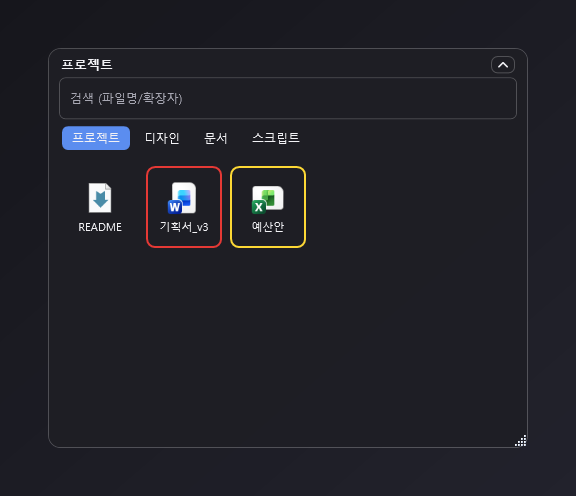
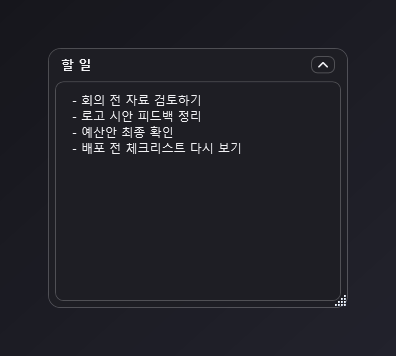
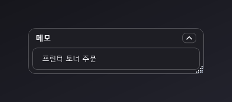
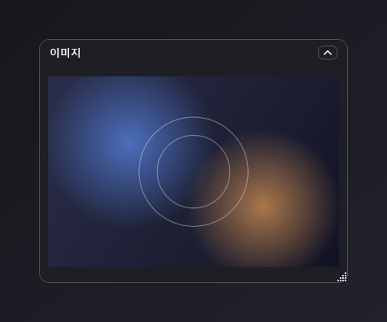
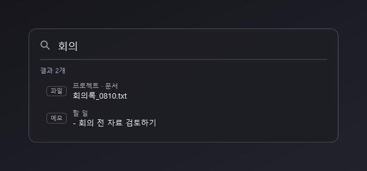
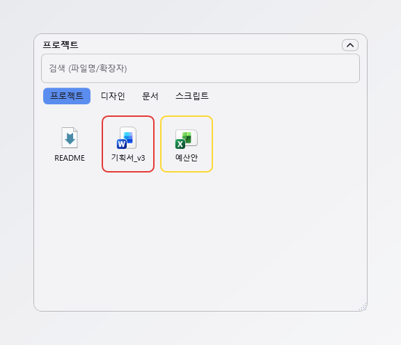
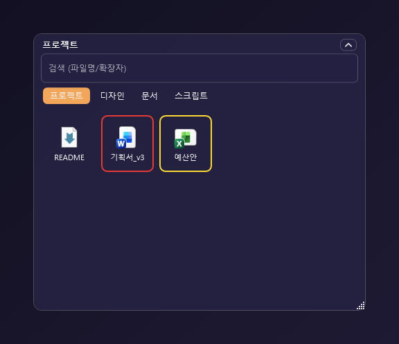

# DeskMate

바탕화면에 상시 떠 있는 가벼운 폴더 · 메모 · 이미지 오버레이 위젯 (Windows 10 이상)

- 자주 쓰는 폴더를 바탕화면 위젯으로 띄우고, 하위 폴더는 탭으로 정리
- 메모 오버레이로 잊으면 안 되는 내용을 눈앞에 고정 (전체 메모 통합 검색 지원)
- 이미지 · GIF 오버레이
- 다크 / 라이트 / 커스텀 테마, 오버레이별 투명도 · 색상
- 설정 백업 · 복원으로 다른 PC에서 그대로 사용

> 아래 화면들은 실제 데모용 샘플 데이터로 찍은 스크린샷입니다 (배경은 실제 바탕화면이 아니라 위젯이 잘 보이도록 넣은 단색 배경).

## 폴더 오버레이



자주 쓰는 폴더를 바탕화면에 띄워 놓고 바로 열어봅니다. 하위 폴더는 자동으로 탭이 되고, 파일에는 색상 라벨을 붙여 눈에 띄게 할 수 있습니다. 검색창으로 지금 탭 안에서 바로 찾을 수 있습니다.

## 메모 오버레이

바탕화면에 늘 보이는 메모장입니다. 왼쪽은 일반 모드, 오른쪽은 **한 줄 모드** — 마지막 줄만 보여주고 Enter로 새 줄을 이어 쓰는 컴팩트한 로그용 모드입니다.

<table>
<tr>
<td align="center"></td>
<td align="center"></td>
</tr>
</table>

## 이미지 · GIF 오버레이



이미지나 GIF 파일 하나를 띄워두거나, 폴더를 감시해서 그 안의 최신 파일을 자동으로 보여주는 모드도 있습니다.

## 전체 찾기 (Ctrl+Shift+F)



지금 바탕화면에 없는 오버레이까지 포함해서, 모든 메모 내용과 파일 이름을 한 번에 찾습니다. 메모 · 파일 · 폴더가 종류 배지로 구분되어 나옵니다.

## 테마

다크 / 라이트, 그리고 배경·강조 색상을 직접 고르는 커스텀 테마를 지원합니다.

<table>
<tr>
<td align="center"><br><sub>다크</sub></td>
<td align="center"><br><sub>라이트</sub></td>
<td align="center"><br><sub>커스텀</sub></td>
</tr>
</table>

## 다운로드

[**최신 버전 받기**](../../releases/latest) → `DeskMate-vX.Y.Z.exe` 하나만 받으면 된다.

별도 설치나 .NET 런타임 설치가 필요 없다. 원하는 폴더에 두고 실행하면 트레이에 상주한다.

## 처음 실행할 때 경고가 뜨는 경우

코드 서명 인증서가 없어서 Windows SmartScreen이 다음 안내를 띄울 수 있다.

> Windows의 PC 보호 — Microsoft Defender SmartScreen에서 인식할 수 없는 앱의 시작을 차단했습니다.

**추가 정보** → **실행**을 누르면 실행된다. 파일이 맞는지 확인하고 싶다면 릴리스 노트에 적힌
SHA256 값과 아래 명령의 출력이 같은지 비교하면 된다.

```powershell
Get-FileHash .\DeskMate-vX.Y.Z.exe -Algorithm SHA256
```

## 설정과 데이터는 어디에 저장되나

`%AppData%\DeskMate\config.json` 한 파일에 저장된다(메모 내용 포함, 평문).
앱의 **설정 → 백업 · 복원**에서 파일로 내보내고 다른 PC에서 가져올 수 있다.

## 문의 · 오류 신고

[**이슈 남기기**](../../issues/new) — 또는 앱의 **설정 → 정보 · 피드백**에서
"오류 신고" / "기능 제안" 버튼을 누르면 버전 등 진단 정보가 채워진 상태로 이 페이지가 열린다.

진단 정보에는 앱 · Windows · .NET 버전과 오버레이 개수, 테마 · 언어만 담기며
**경로 · 파일명 · 메모 내용은 포함되지 않는다.**

## 라이선스 / 소스

이 저장소는 배포와 이슈 접수용이며 소스 코드는 공개하지 않는다.
